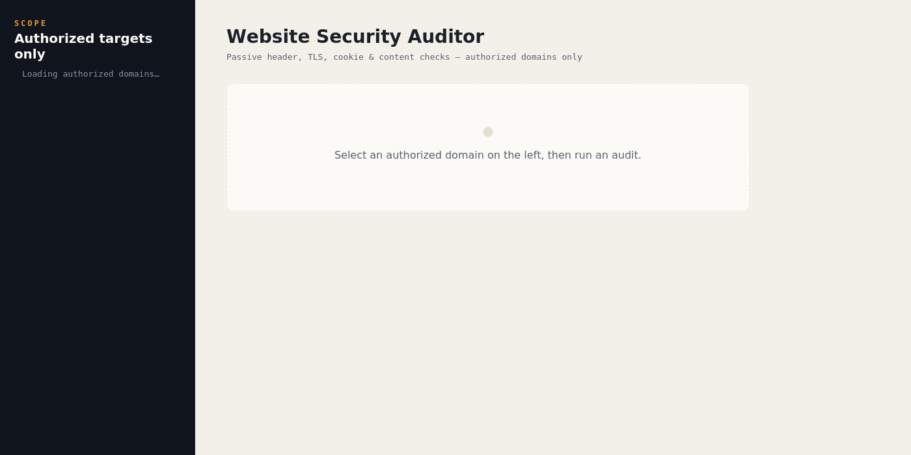
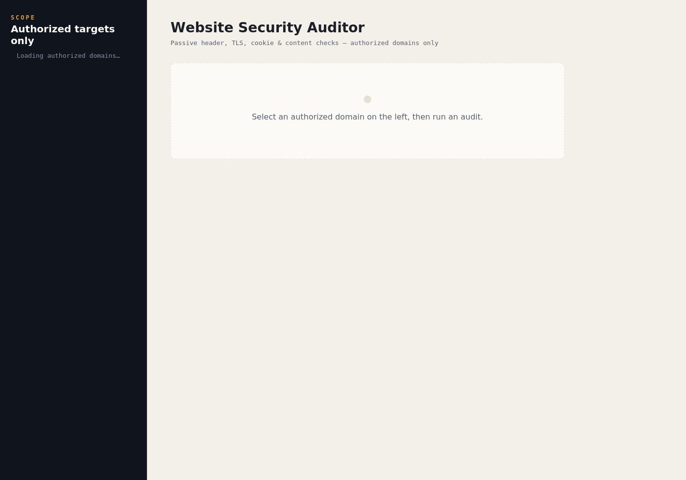

# Website Security Auditor

A passive web security auditing dashboard that checks a site's HTTP
security headers, TLS/certificate configuration, cookie flags, and
static markup for common misconfigurations — restricted to a hardcoded
allowlist of domains, so the tool is architecturally incapable of
scanning anything its operator hasn't explicitly authorized.

Built with Node.js/Express on the backend and a vanilla HTML/CSS/JS
dashboard on the frontend.

## Why the allowlist, not a "scan any URL" box

Most personal security-scanner projects online let you type in any
domain and fire requests at it. That's a liability, not a portfolio
piece — the tool has no way to know whether the person using it is
authorized to test the target. This project takes a different approach:
the list of scannable domains is hardcoded in
[`server/config/allowlist.js`](server/config/allowlist.js) on the
server, checked **before any network request is made to the target**,
and there is no UI, API parameter, or self-service flow that can add a
domain to it. Adding a new site to scan requires editing that file and
redeploying — the same level of access as deploying the site itself.

This mirrors how legitimate tools like Google Search Console or Netlify
scope "your sites" — ownership is tied to the target, not just to
whoever is logged into the UI.

## What it checks (all passive, read-only)

- **HTTP security headers** — HSTS, Content-Security-Policy,
  X-Content-Type-Options, X-Frame-Options, Referrer-Policy,
  Permissions-Policy, with a quality check (e.g. flags a CSP that still
  allows `unsafe-inline`), not just presence/absence.
- **TLS / certificate** — protocol version, cipher, certificate trust
  and expiry, via a single ordinary TLS handshake.
- **Cookies** — Secure / HttpOnly / SameSite flags. Cookie *values* are
  never read, stored, or displayed — only flag presence.
- **Content** — mixed content (HTTP resources on an HTTPS page) and a
  static heuristic for POST forms missing a CSRF-token-shaped hidden
  field.

None of these checks submit forms, send alternate/malicious parameters,
or attempt to exploit anything. Each scan makes exactly one GET request
plus one TLS handshake to the target — the same footprint as a browser
loading the page once.

## Screenshots

**Dashboard, before running a scan** — the scope panel on the left only
ever lists domains from the server-side allowlist:



**Scan results** — grade, severity-sorted findings with remediation
advice, and a detail breakdown per check category (shown here with
illustrative sample data):



## Project structure

```
website-security-auditor/
├── server/
│   ├── server.js              # Express app entry point
│   ├── config/
│   │   └── allowlist.js       # THE authorization boundary - edit this to add domains
│   ├── services/
│   │   ├── httpFetch.js       # single passive GET request
│   │   ├── headerCheck.js     # security header analysis
│   │   ├── tlsCheck.js        # TLS/certificate analysis
│   │   ├── cookieCheck.js     # cookie flag analysis
│   │   ├── contentCheck.js    # mixed content + CSRF field heuristic
│   │   └── scoring.js         # aggregates checks into a grade + findings
│   └── routes/
│       └── scan.js            # /api/scan, /api/allowed-domains
├── public/
│   ├── index.html
│   ├── css/style.css
│   └── js/app.js
├── tests/                     # 23 unit tests (Node's built-in test runner)
├── screenshots/
├── package.json
└── README.md
```

## Requirements

- Node.js 18+

## Installation

```bash
git clone <your-repo-url>
cd website-security-auditor
npm install
```

## Configuration — add your sites

Open `server/config/allowlist.js` and add the hostnames you own:

```js
const ALLOWED_DOMAINS = [
  'yourproject.netlify.app',
  'yourname.infinityfreeapp.com',
  'yourdomain.je',
];
```

No protocol, no path — just the hostname. Restart the server after
editing.

## Usage

```bash
npm start
```

Then open `http://localhost:3000`. Select one of your allowlisted
domains from the scope panel and click **Run Audit**.

The API can also be used directly:

```bash
curl http://localhost:3000/api/allowed-domains

curl -X POST http://localhost:3000/api/scan \
  -H "Content-Type: application/json" \
  -d '{"url": "https://yourproject.netlify.app"}'
```

Requesting a domain that isn't on the allowlist returns an HTTP 403
with no request ever sent to that domain:

```json
{
  "error": "\"not-my-site.com\" is not on the authorized scan list.",
  "hint": "This tool only scans domains the operator has explicitly allowlisted in server/config/allowlist.js. See /api/allowed-domains for the current list."
}
```

## Running the tests

```bash
npm test
```

23 tests covering the allowlist gate, each check module, and the
scoring/grading engine.

## Grading

Each finding has a severity (critical/high/medium/low) with a fixed
point deduction from a 100-point baseline: critical −25, high −15,
medium −8, low −3. The resulting score maps to a letter grade (A ≥ 90,
B ≥ 80, C ≥ 65, D ≥ 50, F below). The weights live in
`server/services/scoring.js` and are intentionally simple and
documented, not a black box.

## Deploying

This is a Node/Express app, so it needs a host that runs a Node
process — not static hosting. Render, Railway, Fly.io, or a small VPS
all work; add your production domains to the allowlist before
deploying and keep `server/config/allowlist.js` out of version control
if you'd rather not publish which sites you're monitoring (add it to
`.gitignore` and provide a `.env`-driven list instead).

## Possible extensions

- Scheduled re-scans with historical grade tracking per domain
- Email/webhook alert when a previously-passing check starts failing
- Export a PDF/CSV report per scan
- A DNS TXT-record verification flow if this ever needs to support
  self-service domain addition instead of a hardcoded list
