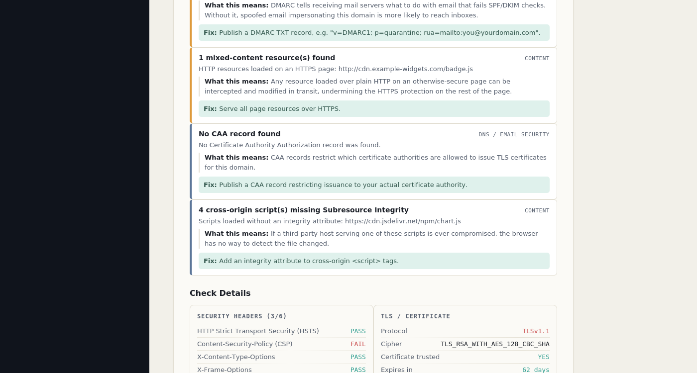

# Website Security Auditor

A passive web security auditing dashboard that checks a site's HTTP
security headers, TLS/certificate configuration, cookie flags, and
static markup for common misconfigurations — restricted to a hardcoded
allowlist of domains, so the tool is architecturally incapable of
scanning anything its operator hasn't explicitly authorized.

Built with Node.js/Express on the backend and a vanilla HTML/CSS/JS
dashboard on the frontend.

## Why the allowlist, not a "scan any URL" box

Most personal security-scanner projects online let you type in any
domain and fire requests at it. That's a liability, not a portfolio
piece — the tool has no way to know whether the person using it is
authorized to test the target. This project takes a different approach:
the list of scannable domains is hardcoded in
[`server/config/allowlist.js`](server/config/allowlist.js) on the
server, checked **before any network request is made to the target**,
and there is no UI, API parameter, or self-service flow that can add a
domain to it. Adding a new site to scan requires editing that file and
redeploying — the same level of access as deploying the site itself.

This mirrors how legitimate tools like Google Search Console or Netlify
scope "your sites" — ownership is tied to the target, not just to
whoever is logged into the UI.

## What it checks (all passive, read-only)

- **HTTP security headers** — HSTS, Content-Security-Policy,
  X-Content-Type-Options, X-Frame-Options, Referrer-Policy,
  Permissions-Policy, with a quality check (e.g. flags a CSP that still
  allows `unsafe-inline`), not just presence/absence. Every check
  includes a plain-English explanation of what it does and why it
  matters, not just a pass/fail.
- **TLS / certificate** — protocol version, cipher, certificate trust
  and expiry, via a single ordinary TLS handshake.
- **Cookies** — Secure / HttpOnly / SameSite flags, plus `__Host-` /
  `__Secure-` prefix validation. Cookie *values* are never read, stored,
  or displayed — only flag presence.
- **Content** — mixed content (HTTP resources on an HTTPS page), a
  static heuristic for POST forms missing a CSRF-token-shaped hidden
  field, and Subresource Integrity (SRI) checks on cross-origin
  `<script>` tags.
- **CORS misconfiguration** — checks whether the server reflects an
  arbitrary `Origin` back in `Access-Control-Allow-Origin` while also
  allowing credentials, a combination that lets any website read this
  site's authenticated API responses on a logged-in visitor's behalf.
- **DNS / email security** — SPF, DMARC, and CAA records via ordinary
  DNS lookups, flagging domains that are easy to spoof in phishing email
  or that allow certificate issuance from any public CA.
- **Exposed files & directories** — checks a small, fixed list of
  well-known paths (`.git/HEAD`, `.env`, SQL backups, etc.) that should
  never be publicly accessible. Every request is an ordinary GET to a
  documented path — nothing is submitted and no authentication is
  bypassed.
- **Information disclosure** — flags `Server`/`X-Powered-By` headers
  that reveal specific software versions.
- **Subdomain takeover** — checks whether this hostname's CNAME points
  at a third-party service (GitHub Pages, Heroku, S3, Netlify, etc.)
  that's currently returning an "unclaimed resource" response — the
  signature of a real, confirmed takeover vulnerability, where an
  attacker could register the abandoned resource and serve content from
  a trusted domain.
- **HTTP method enumeration** — a single OPTIONS request checking
  whether PUT/DELETE/TRACE/CONNECT are enabled unnecessarily. TRACE
  specifically enables Cross-Site Tracing, a technique that can leak
  HttpOnly cookies.
- **Directory listing detection** — checks common paths for an exposed
  auto-generated "Index of /" listing.
- **DNSSEC** — checks whether DNS responses for the domain can be
  cryptographically verified, via a DNS-over-HTTPS lookup (Node's
  built-in DNS module doesn't support the DNSKEY record type).
- **Certificate Transparency** — queries the public crt.sh log for
  every certificate ever issued for the domain, which often surfaces
  forgotten subdomains (`staging.`, `old-admin.`, etc.) nobody
  remembers exist. This is informational recon, not a vulnerability by
  itself, so it never affects the score.

None of these checks submit forms, send alternate/malicious parameters,
or attempt to exploit anything. A scan makes a small, fixed number of
ordinary GET/OPTIONS requests, one TLS handshake, a few DNS lookups, and
two read-only queries to public third-party infrastructure (a DNS-over-
HTTPS resolver and the crt.sh certificate log) — comparable to what a
browser does loading the page plus a handful of standard reconnaissance
queries.

### Where the scope boundary is, on purpose

This project deliberately stops at passive reconnaissance and does not
include active testing — sending crafted or malicious input and
observing how the application responds (injection payloads, auth
bypass attempts, parameter fuzzing, forced browsing past access
controls). That's a firm line, not an oversight: a tool with active
capability can't tell an authorized target from an unauthorized one
once it leaves this codebase, and every check listed above was chosen
specifically because it stays on the safe side of that line while still
surfacing findings with genuine, confirmed impact (subdomain takeover
and CORS misconfiguration in particular).

## PDF reports

Every scan result can be exported as a PDF via the **Download PDF
Report** button (or `POST /api/scan/report.pdf`). The report includes
the grade, a severity-scale explanation, and every finding with its
plain-English explanation and remediation step — formatted to send
directly to a site owner or attach to a bug bounty submission.

## Screenshots

**Dashboard, before running a scan** — the scope panel on the left only
ever lists domains from the server-side allowlist:


**Scan results** — grade, severity-sorted findings with plain-English
explanations and remediation advice, and a "Download PDF Report" button
(shown here with illustrative sample data, since this environment has
no live deployed site of mine to scan against for the screenshot):


**Check details** — a per-category breakdown (headers, TLS, cookies,
content, CORS, DNS/email security, exposed files):



## Project structure

```
website-security-auditor/
├── server/
│   ├── server.js              # Express app entry point
│   ├── config/
│   │   └── allowlist.js       # THE authorization boundary - edit this to add domains
│   ├── services/
│   │   ├── httpFetch.js       # single passive GET request
│   │   ├── headerCheck.js     # security header analysis + version disclosure
│   │   ├── tlsCheck.js        # TLS/certificate analysis
│   │   ├── cookieCheck.js     # cookie flag + prefix analysis
│   │   ├── contentCheck.js    # mixed content, CSRF field heuristic, SRI
│   │   ├── corsCheck.js       # CORS misconfiguration detection
│   │   ├── dnsCheck.js        # SPF/DMARC/CAA lookups
│   │   ├── exposureCheck.js   # sensitive file/directory exposure
│   │   ├── subdomainTakeover.js  # dangling CNAME / takeover detection
│   │   ├── httpMethods.js     # risky HTTP method enumeration
│   │   ├── directoryListing.js   # exposed directory listing detection
│   │   ├── dnssecCheck.js     # DNSSEC configuration check
│   │   ├── certTransparency.js   # public CT log subdomain discovery
│   │   ├── scoring.js         # aggregates checks into a grade + findings
│   │   └── pdfReport.js       # renders a scan result to a PDF report
│   └── routes/
│       └── scan.js            # /api/scan, /api/scan/report.pdf, /api/allowed-domains
├── public/
│   ├── index.html
│   ├── css/style.css
│   └── js/app.js
├── tests/                     # 39 unit tests (Node's built-in test runner)
├── screenshots/
├── package.json
└── README.md
```

## Requirements

- Node.js 18+

## Installation

```bash
git clone <your-repo-url>
cd website-security-auditor
npm install
```

## Configuration — add your sites

Open `server/config/allowlist.js` and add the hostnames you own:

```js
const ALLOWED_DOMAINS = [
  'yourproject.netlify.app',
  'yourname.infinityfreeapp.com',
  'yourdomain.je',
];
```

No protocol, no path — just the hostname. Restart the server after
editing.

## Usage

```bash
npm start
```

Then open `http://localhost:3000`. Select one of your allowlisted
domains from the scope panel and click **Run Audit**.

The API can also be used directly:

```bash
curl http://localhost:3000/api/allowed-domains

curl -X POST http://localhost:3000/api/scan \
  -H "Content-Type: application/json" \
  -d '{"url": "https://yourproject.netlify.app"}'
```

Requesting a domain that isn't on the allowlist returns an HTTP 403
with no request ever sent to that domain:

```json
{
  "error": "\"not-my-site.com\" is not on the authorized scan list.",
  "hint": "This tool only scans domains the operator has explicitly allowlisted in server/config/allowlist.js. See /api/allowed-domains for the current list."
}
```

To get a PDF report directly from the API:

```bash
curl -X POST http://localhost:3000/api/scan/report.pdf \
  -H "Content-Type: application/json" \
  -d '{"url": "https://yourproject.netlify.app"}' \
  -o report.pdf
```

## Running the tests

```bash
npm test
```

49 tests covering the allowlist gate, each check module (including
cookie prefix validation and Subresource Integrity detection), the PDF
report generator, and the scoring/grading engine — including scoring
coverage for the subdomain takeover, HTTP methods, directory listing,
DNSSEC, and certificate transparency findings.

## Grading

Each finding has a severity — Critical, High, Medium, or Low, the same
four working tiers used by CVSS and every major bug bounty program —
with a fixed point deduction from a 100-point baseline: critical −30,
high −15, medium −8, low −3. The resulting score maps to a letter grade
(A ≥ 90, B ≥ 80, C ≥ 65, D ≥ 50, F below). The weights live in
`server/services/scoring.js` and are intentionally simple and
documented, not a black box.

## On bug bounty use

This tool surfaces real, legitimate findings — and on a genuinely
neglected target, some of them (an exposed `.env` file, a broken CORS
config) can be Critical by any standard definition. But it's worth being
direct about what this class of tool can and can't do: automated
scanner output is extremely common in bug bounty programs, and most
programs explicitly deprioritize findings a scanner could have produced
a year ago (missing headers, version disclosure) in favor of things a
scanner structurally cannot find — broken authorization logic, business
logic flaws, auth bypasses — which require manually reading and
understanding the specific application. This tool is a solid recon/audit
layer and a legitimate portfolio piece, not a shortcut to payouts on its
own. Always read a program's scope and rules of engagement before
testing anything, regardless of how "passive" a check is.

## Deploying

This is a Node/Express app, so it needs a host that runs a Node
process — not static hosting. Render, Railway, Fly.io, or a small VPS
all work; add your production domains to the allowlist before
deploying and keep `server/config/allowlist.js` out of version control
if you'd rather not publish which sites you're monitoring (add it to
`.gitignore` and provide a `.env`-driven list instead).

## Possible extensions

- Scheduled re-scans with historical grade tracking per domain
- Email/webhook alert when a previously-passing check starts failing
- CSV export alongside the existing PDF report
- A DNS TXT-record verification flow if this ever needs to support
  self-service domain addition instead of a hardcoded list
